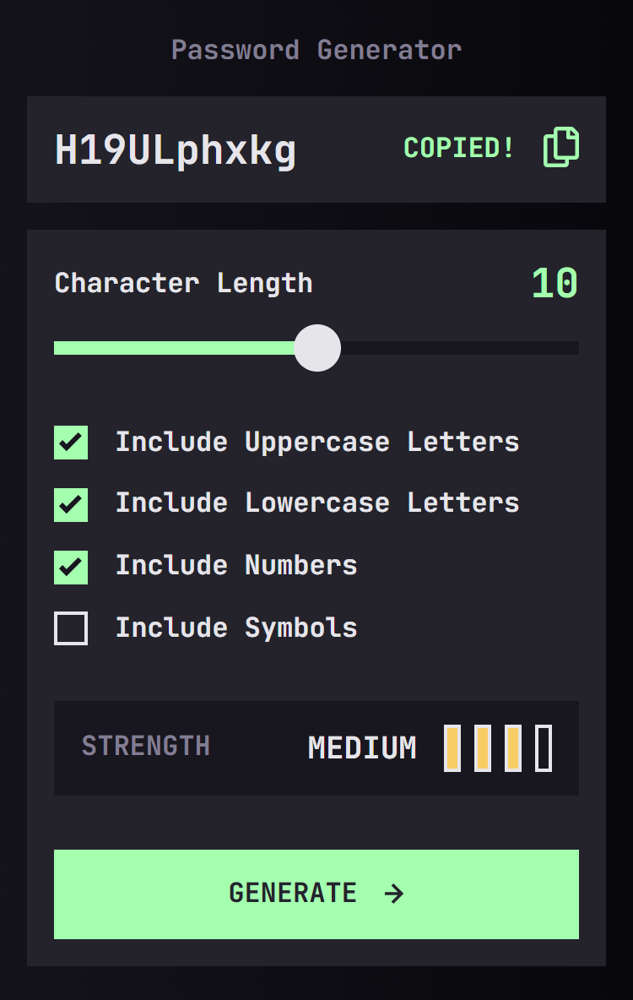
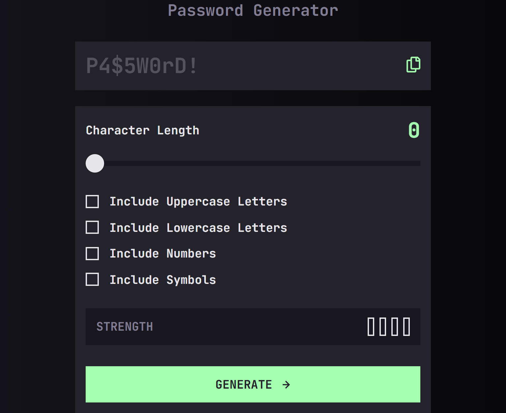

# Frontend Mentor - Password generator app solution

This is a solution to the [Password generator app challenge on Frontend Mentor](https://www.frontendmentor.io/challenges/password-generator-app-Mr8CLycqjh). Frontend Mentor challenges help you improve your coding skills by building realistic projects.

## Table of contents

- [Frontend Mentor - Password generator app solution](#frontend-mentor---password-generator-app-solution)
  - [Table of contents](#table-of-contents)
  - [Overview](#overview)
    - [The challenge](#the-challenge)
    - [Screenshot](#screenshot)
    - [Links](#links)
  - [My process](#my-process)
    - [Built with](#built-with)
    - [What I learned](#what-i-learned)
    - [Continued development](#continued-development)
    - [AI Collaboration](#ai-collaboration)
  - [Author](#author)

## Overview

### The challenge

Users should be able to:

- Generate a password based on the selected inclusion options
- Copy the generated password to the computer's clipboard
- See a strength rating for their generated password
- View the optimal layout for the interface depending on their device's screen size
- See hover and focus states for all interactive elements on the page

### Screenshot





### Links

- Solution URL: [https://github.com/ChechiX/password-generator-app](https://github.com/ChechiX/password-generator-app)
- Live Site URL: [https://password-generator-app-chechix.netlify.app/](https://password-generator-app-chechix.netlify.app/)

## My process

### Built with

- Semantic HTML5 markup
- CSS custom properties
- Flexbox
- Mobile-first workflow
- [React](https://reactjs.org/) - JS library
- [Sass](https://sass-lang.com/) - For styles

### What I learned

This was a great project to practice working with React and Sass. I also had the opportunity to implement a password strength algorithm, which was a fun challenge. I learned how to use the `navigator.clipboard` API to copy text to the clipboard, which was a new experience for me.

```js
const handleCopy = async () => {
  if (!password) return;

  await navigator.clipboard.writeText(password);

  onCopy();
};
```

### Continued development

I want to continue focusing on React since I liked the technology, and before I start building the layout, I want to analyze the states I'll have to avoid refactoring later. I also want to practice more with Sass, especially with mixins, to make my styles more efficient and reusable.

### AI Collaboration

- **Tool used:** GitHub Copilot Chat.
- **How I used it:** Debugging logic, structuring React components and state flow, styling with SCSS/BEM (range input, strength bars), and implementing clipboard copy feedback.
- **What worked well:** Step-by-step problem solving and catching logic errors early.
- **What didn't:** Some visual details still needed manual tweaking and cross-browser testing.

## Author

- Frontend Mentor - [@ChechiX](https://www.frontendmentor.io/profile/ChechiX)
